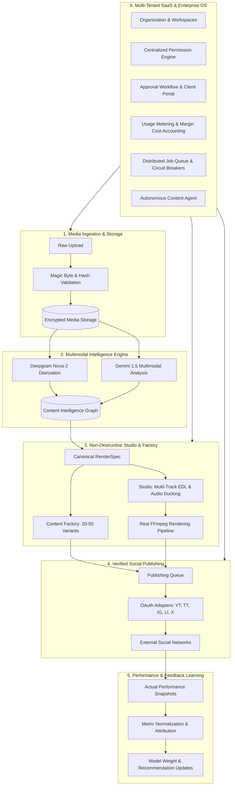

# CLIPPER SYSTEM ARCHITECTURE BLUEPRINT

**Platform:** Clipper AI Video Content Operating System  
**Version:** 1.0.0-RELEASE  
**Architecture Style:** Event-Driven, Multi-Tenant Modular Monolith with Distributed Worker Processing

---

## 1. High-Level Architectural Topology

Clipper is designed as a unified pipeline where source media is processed into structured multimodal intelligence, synthesized into non-destructive editing instructions, generated into platform-tailored opportunities, scheduled and published through verified OAuth adapters, monitored for real performance metrics, and managed within a strictly isolated multi-tenant agency framework.



---

## 2. Core Subsystem Architectures

### 2.1 Media Engine (`lib/ffmpeg/`, `lib/media/`, `lib/enterprise/mediaLifecycle.ts`)
- **Execution Model:** Subprocess execution via `child_process.spawn` using explicit argument arrays. Shell interpretation (`exec`) is strictly prohibited to eliminate command injection vulnerabilities.
- **Verification:** Binary magic bytes inspection (`ftyp` at offset 4 for MP4; `0x1A 0x45 0xDF 0xA3` for WebM) prior to persisting media objects.
- **Deduplication:** SHA-256 streaming hash computes content fingerprints. Duplicate uploads across workspaces reuse stored assets while isolating reference entities.
- **Signed URLs:** Direct access to raw storage is disabled; downloads are mediated through time-limited (15m) signed URLs.

### 2.2 Multimodal Intelligence Engine (`lib/intelligence/`)
- **Transcription & Diarization:** Deepgram Nova-2 extracts word-level start/end timestamps, speaker diarization IDs, and confidence ratings.
- **Multimodal Video Understanding:** Google Gemini 1.5 Pro analyzes visual scene boundaries, pacing, emotional shifts, information density, and hook opportunities.
- **Canonical Intelligence Graph:** Outputs structured candidates scored by curiosity, pacing, and viral potential. Synthetic engagement numbers (e.g. fake "1.2M expected views") are strictly forbidden.

### 2.3 Studio Workstation & Canonical RenderSpec (`lib/editor/`)
- **Canonical State Model:** Centralized `CanonicalRenderSpec` is the single source of truth for the timeline, canvas, audio automation, and rendering output.
- **Multi-Track EDL:** Independent video, audio, overlay, and subtitle tracks supporting frame-accurate splits, trims, translations, and transitions.
- **Audio Ducking:** Calculates dynamic volume keyframes on background audio tracks based on speech presence intervals.
- **Version History:** Non-destructive timeline version stack supporting infinite undo/redo and branching revision states.

### 2.4 Content Factory (`lib/factory/`)
- **Opportunity Extractor:** Identifies 20–50 high-retention segments per long-form video.
- **Platform Variants:** Translates opportunities into format-specific assets:
  - **YouTube Shorts:** 9:16 vertical, duration $\le 60$s, SEO-optimized title $\le 100$ characters.
  - **TikTok:** 9:16 vertical, trending sound cues, caption $\le 2200$ characters.
  - **Instagram Reels:** 9:16 vertical, aesthetic caption, hashtag clusters.
  - **LinkedIn / X:** 1:1 square or 16:9 landscape, professional hook summaries, thread formats.
- **Asset Lineage:** Tracks full lineage from source video $\to$ candidate $\to$ RenderSpec $\to$ rendered MP4 $\to$ publication record.

### 2.5 Real Social Publishing Engine (`lib/publishing/`)
- **Credential Security:** OAuth access and refresh tokens are encrypted using AES-256-GCM. Raw plaintext tokens are never written to disk or logs.
- **Adapters:** Dedicated, verified API adapters for YouTube, TikTok, Instagram, LinkedIn, and X.
- **Idempotency:** SHA-256 idempotency key (`workspaceId + assetId + platform + scheduledAt`) enforces single-submission guarantees.
- **Queue & Worker Engine:** Exponential backoff retry with jitter; automatic error classification (`RATE_LIMIT`, `EXPIRED_AUTH`, `NETWORK_FAILURE`).

### 2.6 Performance Intelligence & Feedback Loop (`lib/analytics/`)
- **Data Ingestion:** Platform metrics (`views`, `likes`, `comments`, `shares`, `watchTime`, `retentionRate`) are ingested via external APIs into `PerformanceSnapshot`.
- **Normalization:** Engagement rate normalized across impressions and reach without fabricating numbers.
- **Attribution & Learning:** Links observed performance back to editorial hook scores to refine future content candidate selection.

### 2.7 Agency Multi-Tenant SaaS Operating System (`lib/saas/`)
- **Tenancy Hierarchy:** `Organization -> Workspace -> Client -> Project -> Asset`.
- **RBAC Engine:** Centralized `can(user, action, resource)` policy evaluator supporting 7 distinct roles (`OWNER`, `ADMIN`, `MANAGER`, `EDITOR`, `APPROVER`, `CLIENT`, `VIEWER`).
- **Approval Pipeline:** Finite state machine (`DRAFT` $\to$ `IN_REVIEW` $\to$ `CLIENT_REVIEW` $\to$ `CHANGES_REQUESTED` $\to$ `APPROVED` $\to$ `SCHEDULED` $\to$ `PUBLISHED`).
- **Client Portal:** Isolated `/portal` route allowing brand clients to review renders, leave timestamped video comments, and approve publications.
- **Usage & Cost Ledger:** Granular metering of render seconds, storage bytes, and AI tokens. Real-time gross margin calculation against provider API costs.

### 2.8 Enterprise Autonomous Content Operating System (`lib/enterprise/`)
- **Distributed Job Queue:** Fair multi-tenant leasing with priority levels (`CRITICAL`, `HIGH`, `NORMAL`, `LOW`), worker heartbeats, and Dead Letter Queue.
- **AI Registry & Circuit Breakers:** Monitors provider health (`CLOSED`, `OPEN`, `HALF_OPEN`). On provider degradation, seamlessly falls back to secondary models or degraded local operation.
- **Autonomous Content Agent:** Executes multi-step DAG workflows while enforcing the **Human Approval Boundary**: the agent automatically halts prior to external social syndication until explicitly approved by a human operator.
- **Transactional Outbox:** Guarantees reliable, idempotent event publication across distributed services.

---

## 3. Storage & Database Schema Architecture

```
PostgreSQL / Supabase
├── organizations (Multi-tenant root, billing plan, lifecycle)
├── workspaces (Isolated operational boundary)
├── organization_memberships (User RBAC mapping)
├── clients (Agency client profiles & retainers)
├── media_assets (Verified media uploads & SHA-256 hashes)
├── projects (Source video projects & status)
├── timeline_versions (Non-destructive RenderSpec snapshots)
├── content_opportunities (Extracted intelligence segments)
├── publications (Social post records & external identifiers)
├── performance_snapshots (Observed platform analytics)
├── usage_ledger (Granular resource consumption ledger)
├── api_keys (Hashed credential vault)
├── audit_logs (Immutable operational trail)
└── support_tickets (Customer issue tracking)
```

---

## 4. Scalability & Operational Guarantees

1. **Zero Downtime Degradation:** If an external AI provider fails, circuit breakers trip within 3 attempts, allowing the studio editor, timeline rendering, and approval queue to remain fully functional.
2. **Crash Tolerance:** Worker nodes hold leases with automatic expiration; crashed workers release their jobs, which are recovered and reassigned to healthy workers.
3. **Tenant Boundary Enforcement:** Frontend filtering is never relied upon for security. Every API route and database query enforces workspace and organization ownership checks through server-side authorization and PostgreSQL RLS.
