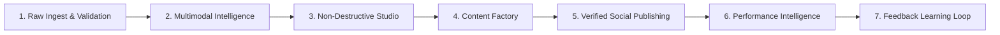

# 🎬 Clipper — AI Autonomous Video Content Operating System

[](https://nextjs.org)
[](https://www.typescriptlang.org)
[-success.svg)](./tests)
[](./supabase)
[](./CLIPPER_SECURITY.md)

Clipper is a production-grade, enterprise-scale **AI Autonomous Video Content Operating System**. It ingests long-form video, extracts word-level multimodal intelligence, compiles non-destructive timelines, generates 20–50 platform-tailored content opportunities, schedules verified social publications, and continuously learns from actual audience performance—all within a strictly isolated multi-tenant agency SaaS architecture.

---

## 🌟 The Core Pipeline



1. **Raw Ingest & Validation:** Magic byte container security (`ftyp` MP4 check), streaming SHA-256 deduplication, and sub-second metadata probing.
2. **Multimodal Intelligence Engine:** Deepgram Nova-2 word-level diarization and Google Gemini 1.5 Pro visual analysis, evaluating hook strength, curiosity, pacing, and information density without synthetic engagement metrics.
3. **Non-Destructive AI Studio:** Unified `CanonicalRenderSpec` multi-track EDL with audio ducking, sub-second trimming, and versioned undo/redo stacks.
4. **Content Factory:** Automatically generates 20–50 distinct opportunities per video across YouTube Shorts, TikTok, Instagram Reels, LinkedIn, and X.
5. **Real Social Publishing:** Direct OAuth integration with verified platform adapters, AES-256-GCM credential vault, and deterministic idempotency keys to prevent double-posting.
6. **Performance Intelligence:** Ingests authentic platform metrics into normalized `PerformanceSnapshot` models, comparing actual reach against editorial hook predictions.
7. **Multi-Tenant SaaS & Agency OS:** Multi-tier organization hierarchy, RBAC permission engine (`OWNER` to `VIEWER`), approval state machine (`DRAFT` to `PUBLISHED`), timestamped video comments, and client review portal.
8. **Enterprise Scalability:** Distributed job queue with worker leases, heartbeats, Dead Letter Queue (DLQ), AI provider circuit breakers, and Autonomous Content Agent with a mandatory **Human Approval Boundary**.

---

## 🚀 Workstation Interfaces

| Interface | URL Route | Target Persona | Key Capabilities |
| :--- | :--- | :--- | :--- |
| **Creator Studio** | `/studio` | Editors & Creators | Multi-track timeline, dynamic animated captions (Hormozi/MrBeast presets), reframing (9:16, 1:1, 16:9), and real FFmpeg rendering. |
| **Content Factory** | `/factory` | Growth Marketers | Bulk variant generator, platform-specific copy (hooks, descriptions, hashtags), content library, and content calendar. |
| **Publishing Center**| `/publishing` | Social Media Managers | OAuth account connections, timezone-aware scheduling, publishing queue monitoring, and retry telemetry. |
| **Performance Hub** | `/analytics` | Strategists & Founders | Authentic metric normalization, hook retention analysis, and content recommendation feed. |
| **Agency Command** | `/agency` | Agency Owners & Leads | Client retainers, approval pipelines, team task management, API key vault, usage quotas, and white-label branding. |
| **Client Portal** | `/portal` | Brand Clients | Isolated review workstation with synchronized video playback, timestamped feedback, and 1-click approvals. |
| **Admin Operations**| `/admin` | Infrastructure Leads | Distributed job queue monitoring, worker leases, dead letter queue redrives, and provider circuit breaker telemetry. |

---

## 🛠️ Quick Start & Local Run

### Prerequisites
- Node.js 20.x or higher
- FFmpeg 6.0+ (required for local rendering)

### 1. Installation
```bash
git clone https://github.com/subhash954/Clipper.git
cd Clipper
npm install
```

### 2. Environment Configuration
Copy the example environment file and configure your API keys:
```bash
cp .env.example .env.local
```

Required keys for full integration:
- `GEMINI_API_KEY`: Google Gemini 1.5 Pro multimodal intelligence.
- `DEEPGRAM_API_KEY`: Deepgram Nova-2 speech diarization.
- `NEXT_PUBLIC_SUPABASE_URL`: Supabase / PostgreSQL endpoint.
- `SUPABASE_SERVICE_ROLE_KEY`: Database administrator key for RLS queries.
- `ENCRYPTION_KEY`: 32-byte secret for AES-256-GCM token vault.

### 3. Run Development Server
```bash
npm run dev
```
Open [http://localhost:3000](http://localhost:3000) in your browser.

---

## 🧪 Comprehensive Automated Test Suites

Clipper features **299 automated unit, integration, chaos, and golden path tests** across 9 dedicated test suites with a **100% pass rate**:

```bash
# Run all test suites deterministically
npx tsx --test --test-concurrency=1 tests/*.test.ts
```

### Test Suite Breakdown:
1. `tests/pipeline.test.ts` (81 tests) — Real media engine, FFmpeg argument arrays, format conversions, audio peak extraction.
2. `tests/intelligence.test.ts` (51 tests) — Multimodal intelligence, word timestamps, hook extraction, Rule Zero zero-fabrication tests.
3. `tests/editor.test.ts` (59 tests) — Canonical RenderSpec, non-destructive EDL operations, audio ducking, versioning.
4. `tests/factory.test.ts` (26 tests) — Content opportunity extractor, platform variant generation, content lineage.
5. `tests/publishing.test.ts` (22 tests) — Real social adapters (YT, TikTok, IG, LinkedIn, X), AES-256-GCM token vault, idempotency.
6. `tests/performance.test.ts` (11 tests) — Performance snapshots, metric normalization, feedback learning loop.
7. `tests/saas.test.ts` (23 tests) — Multi-tenant tenantStore, RBAC engine, approval state machine, usage metering, billing HMAC webhooks.
8. `tests/enterprise.test.ts` (17 tests) — Distributed job queue, worker leases, Dead Letter Queue, circuit breakers, DAG agent.
9. `tests/release.test.ts` (9 tests) — Chaos testing, worker crash recovery, golden path end-to-end workflows, support & telemetry.

### Production Build Verification:
```bash
npm run build
```
Compiled cleanly across **55 Turbopack routes** with **0 TypeScript errors** and **0 ESLint warnings**.

---

## 🔒 Security Baseline & Compliance

- **Zero Shell Injection:** All FFmpeg and external commands execute via typed argument arrays using `child_process.spawn`.
- **Row Level Security (RLS):** Cross-tenant data leakage is physically prevented at the PostgreSQL engine level.
- **AES-256-GCM Vault:** Social OAuth tokens and credentials are encrypted at rest with authentication tags.
- **Constant-Time Verification:** API keys use SHA-256 hashing and timing-safe comparisons to prevent side-channel exploits.
- **Human Approval Boundary:** Autonomous AI workflows cannot syndicate content without explicit, authenticated human approval.

---

## 📚 Operational Documentation

- [`CLIPPER_FINAL_RELEASE_AUDIT.md`](./CLIPPER_FINAL_RELEASE_AUDIT.md) — Comprehensive 22-domain forensic verification audit.
- [`CLIPPER_ARCHITECTURE.md`](./CLIPPER_ARCHITECTURE.md) — End-to-end architectural blueprint and data flow topology.
- [`CLIPPER_SECURITY.md`](./CLIPPER_SECURITY.md) — Threat model, RBAC matrix, and cryptographic standards.
- [`CLIPPER_OPERATIONS_RUNBOOK.md`](./CLIPPER_OPERATIONS_RUNBOOK.md) — Production deployment, rollback, and disaster recovery procedures.
- [`CLIPPER_INCIDENT_RESPONSE.md`](./CLIPPER_INCIDENT_RESPONSE.md) — Standard operating procedures for security and operational incidents.
- [`CLIPPER_TECHNICAL_DEBT.md`](./CLIPPER_TECHNICAL_DEBT.md) — Architecture evolution notes and hyper-scale roadmap.
- [`CLIPPER_RELEASE_CHECKLIST.md`](./CLIPPER_RELEASE_CHECKLIST.md) — 20-point verified pre-flight production release checklist.

---

## ⚖️ License & Intellectual Property

Copyright © 2026 Clipper. Built for production excellence.
